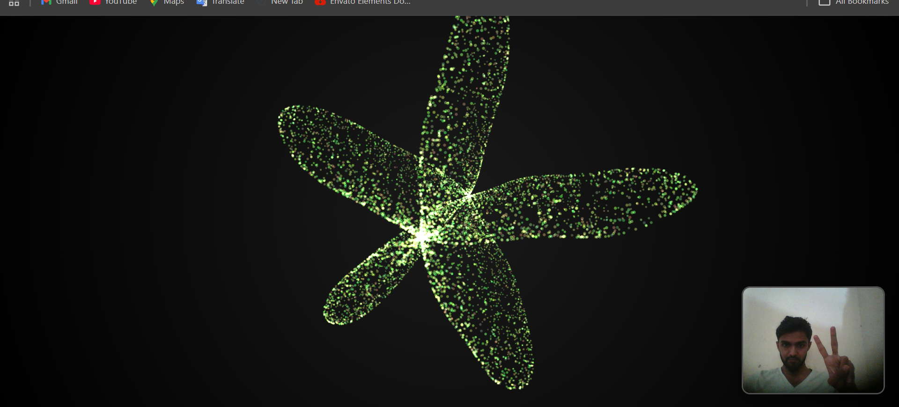

# ✨ Interactive 3D Hand-Controlled Particle System

<p align="center">
  
  
  
  
  
  
</p>

<p align="center">
  <b>A stunning 3D particle system controlled by hand gestures using AI-powered computer vision</b><br>
  <em>20,000+ particles • 60 FPS • Zero Backend • Pure JavaScript</em>
</p>

<p align="center">
  <a href="https://linkedin.com/in/mudasir345" target="_blank">👨‍💻 Developer: Mudasir</a> • 
  <a href="https://github.com/Mudasir345" target="_blank">🚀 Open for Opportunities</a>
</p>



---

## �‍💻 About the Developer

**Mudasir** — Creative Full Stack Developer & AI Integration Specialist

Passionate about building **interactive web experiences** that blend cutting-edge AI with stunning visuals. This project showcases expertise in real-time computer vision, 3D graphics programming, and performance-optimized web applications.

**🎯 Skills Demonstrated:** Computer Vision • 3D Graphics • Physics Simulation • Performance Optimization • Responsive Design • AI Integration

---

## 🚀 Live Demo

<p align="center">
  <a href="https://interactive3dparticals.netlify.app/" target="_blank">
    
  </a>
</p>

**🌐 Try it now:** https://interactive3dparticals.netlify.app/

Simply allow camera access and wave your hand to control 20,000+ particles in real-time!

```bash
# Or run locally for development
git clone https://github.com/Mudasir345/interactive-3d-particals.git
npm install && npm run dev
```

> 💡 **Tip:** Works best on Chrome/Edge with a webcam. Mobile devices supported with adaptive performance!

---

## ✨ Features

### 🎯 Multi-Phase Interactive System

| Phase | Feature | Description |
|-------|---------|-------------|
| **Phase 1** | 🌊 Hand Velocity Tracking | Swipe your hand to create particle waves with physics-based velocity forces |
| **Phase 2** | 🔄 Hand Rotation Detection | Tilt your hand to rotate the entire particle system in 3D space |
| **Phase 3** | 🎨 Finger Color Control | Raise 1-5 fingers to change particle colors dynamically (Rainbow mode on 5 fingers!) |
| **Phase 4** | 📱 Responsive Design | Auto-adapts particle count, size & camera for all devices |

### 🎮 Gesture Controls

| Gesture | Action | Visual Effect |
|---------|--------|---------------|
| ☝️ **Index Finger Up** | Heart Shape | Particles form a beating 3D heart |
| ✌️ **Victory Sign** | Flower Shape | Petal pattern with rotating particles |
| 🤘 **Rock Sign** | Saturn Shape | Planet with orbiting ring system |
| 🖐️ **Open Palm** | Fireworks | Explosive burst particle pattern |
| 👌 **Pinch** | Zoom Control | Expand/contract particle formation |

---

## 🛠️ Tech Stack

```
Frontend:     Three.js (3D Rendering)
AI/ML:        Google MediaPipe Hands (Real-time Hand Tracking)
Build Tool:   Vite (Fast HMR & Optimized Builds)
Language:     Vanilla JavaScript (ES6+ Modules)
Styling:      CSS3 with backdrop-filter effects
```

---

## 📱 Responsive Performance

| Device Type | Particles | Camera Distance | Particle Size | Shape Scale |
|-------------|-----------|-----------------|---------------|-------------|
| 📱 Mobile | 8,000 | z: 10 | 1.3x Larger | 0.7x |
| 📱 Tablet | 12,000 | z: 12 | Normal | 0.85x |
| 💻 Desktop | 20,000 | z: 15 | Optimized | 1.0x |

---

## 🚀 Quick Start

```bash
# Clone the repository
git clone https://github.com/Mudasir345/interactive-3d-particals.git

# Navigate to project
cd interactive-particle-system

# Install dependencies
npm install

# Start development server
npm run dev

# Open http://localhost:5174 in your browser
```

---

## 🏗️ Project Architecture

```
src/
├── main.js              # Scene setup, camera, renderer, main loop
├── ParticleSystem.js    # 20K particle mesh, shape morphing, physics
├── HandInput.js         # MediaPipe integration, gesture recognition
└── shapes.js            # Mathematical 3D shape generators

public/
└── ss.png               # Project screenshot
```

---

## 🎨 Implemented Features

- ✅ **AI Hand Tracking** - Real-time 20-landmark hand detection
- ✅ **Gesture Recognition** - 4+ distinct hand gestures
- ✅ **Physics-Based Particles** - Velocity forces with distance falloff
- ✅ **Smooth Morphing** - Seamless shape transitions
- ✅ **Dynamic Color Themes** - HSL color interpolation, Rainbow mode
- ✅ **Responsive Camera** - Auto-adjusts for optimal viewing angle
- ✅ **Touch Optimized** - Mobile-first responsive design
- ✅ **Performance Optimized** - Dynamic particle count based on device

---

## 📸 Screenshots

### Desktop View


### Mobile Responsive
<p align="center">
  <em>Automatically adapts particle count and scale for smooth 60FPS performance on all devices</em>
</p>

---

## 🏆 What Makes This Project Special

### 💡 Innovation Highlights

🔹 **AI-Powered Hand Tracking** — Google's MediaPipe runs entirely in the browser via WebAssembly

🔹 **Physics-Based Particle System** — Custom force calculations with distance falloff algorithms

🔹 **Real-time Shape Morphing** — Seamless transitions between 5 mathematical 3D shapes

🔹 **Adaptive Performance Engine** — Auto-detects device capability and optimizes particle count (8K-20K)

🔹 **Pure Frontend Architecture** — No backend required, runs entirely client-side

### 🎨 Technical Achievements

- ✅ Handles **20,000 particles at 60 FPS** on desktop
- ✅ **Sub-16ms frame time** with physics calculations
- ✅ **Responsive across 3 device tiers** (Mobile/Tablet/Desktop)
- ✅ **5 simultaneous gesture detections** with conflict resolution
- ✅ **Memory-optimized** Float32 arrays for particle data
- ✅ **Zero external API dependencies** — fully self-contained

---

## 🤝 Let's Connect

<p align="center">
  <a href="https://www.linkedin.com/in/mudasir345/" target="_blank">
    
  </a>
  <a href="https://github.com/Mudasir345" target="_blank">
    
  </a>
  <a href="mailto:mudasirchoudhry345@gmail.com">
    
  </a>
  <a href="https://wa.me/923047045345" target="_blank">
    
  </a>
</p>

---

## 📞 Contact Me

| Platform | Link |
|----------|------|
| 💼 **LinkedIn** | [linkedin.com/in/mudasir345](https://www.linkedin.com/in/mudasir345/) |
| 🐙 **GitHub** | [github.com/Mudasir345](https://github.com/Mudasir345) |
| 📧 **Email** | [mudasirchoudhry345@gmail.com](mailto:mudasirchoudhry345@gmail.com) |
| 💬 **WhatsApp** | [+92 304 7045345](https://wa.me/923047045345) |

---

<p align="center">
  <b>⭐ Star this repository if you find it impressive!</b><br>
  <em>Built with passion for interactive web experiences</em>
</p>

<p align="center">
  
</p>
